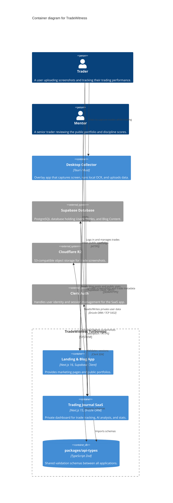

# TradeWitness Architecture

Below is the C4 Container diagram representing the high-level architecture of the TradeWitness platform.

```mermaid
C4Container
    title Container diagram for TradeWitness

    Person(trader, "Trader", "A user uploading screenshots and tracking their trading performance.")
    Person(mentor, "Mentor", "A senior trader reviewing the public portfolio and discipline scores.")

    System_Boundary(tw_mono, "TradeWitness Turborepo") {
        Container(landing_app, "Landing & Blog App", "Next.js 16, Supabase Client", "Provides marketing pages and public portfolios.")
        Container(saas_app, "Trading Journal SaaS", "Next.js 15, Drizzle ORM", "Private dashboard for trade tracking, AI analysis, and stats.")
        
        ContainerDb(shared_types, "packages/api-types", "TypeScript Zod", "Shared validation schemas between all applications.")
    }

    Container(desktop_app, "Desktop Collector", "Tauri / Rust", "Overlay app that captures screen, runs local OCR, and uploads data.")

    System_Ext(supabase_db, "Supabase Database", "PostgreSQL database holding Users, Trades, and Blog Content.")
    System_Ext(cloudflare_r2, "Cloudflare R2", "S3-compatible object storage for trade screenshots.")
    System_Ext(clerk_auth, "Clerk Auth", "Handles user identity and session management for the SaaS app.")

    Rel(trader, landing_app, "Visits", "HTTPS")
    Rel(trader, saas_app, "Logs in and manages trades", "HTTPS")
    Rel(trader, desktop_app, "Uses to capture trades while trading")
    Rel(mentor, landing_app, "Views public portfolios", "HTTPS")

    Rel(desktop_app, saas_app, "Uploads screenshots and trade metadata", "JSON/HTTPS")
    
    Rel(landing_app, supabase_db, "Reads blog posts and public stats", "Supabase Client / REST")
    Rel(saas_app, supabase_db, "Reads/Writes private user data", "Drizzle ORM / TCP 5432")
    
    Rel(saas_app, cloudflare_r2, "Uploads/Deletes screenshots", "aws4fetch / HTTPS")
    Rel(saas_app, clerk_auth, "Validates sessions", "Clerk SDK")
    
    Rel(landing_app, shared_types, "Imports schemas")
    Rel(saas_app, shared_types, "Imports schemas")

    UpdateLayoutConfig($c4ShapeInRow="3", $c4BoundaryInRow="1")
```