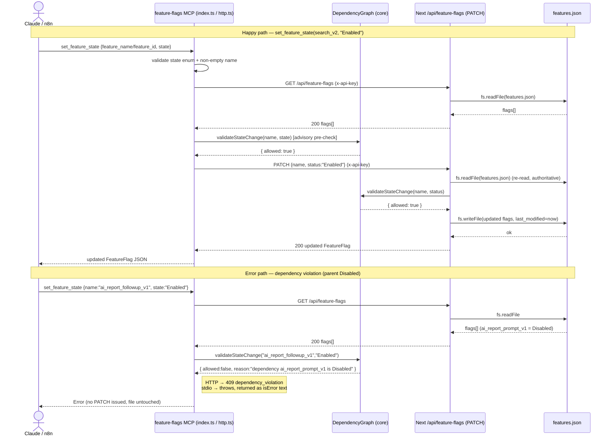

# Feature-Flags MCP — Spec

> Living-doc reverse-engineering spec produced with the 4-step Anthropic Code Modernization pattern
> (UNDERSTAND → DECISION TABLE → SEQUENCE DIAGRAM → EDGE CASES).
> READ-ONLY analysis of the feature-flags MCP module of TradeWitness. No source was modified.

**Module under analysis**

| Layer | File | Role |
|-------|------|------|
| stdio MCP server | `mcps/feature-flags/src/index.ts` | MCP tools for Claude/agents over stdio |
| HTTP wrapper | `mcps/feature-flags/src/http.ts` | REST surface for n8n / curl consumers |
| Core logic | `packages/feature-flags-core/src/index.ts` | Zod schemas + `DependencyGraph` validation |
| Persistence route | `apps/app/src/app/api/feature-flags/route.ts` | Next.js GET/PATCH, the only writer of the JSON file |
| Data | `data/feature-flags/features.json` | Flat array of `FeatureFlag` records (READ-ONLY; never edit directly) |

**Project rule (CLAUDE.md / AGENTS.md):** Feature flags must be changed **only** through the feature-flags MCP tools (`get_feature_info`, `set_feature_state`, `adjust_traffic_rollout`, `list_features`). The `features.json` file must never be edited by hand. The Next.js PATCH route is the single authoritative writer; all MCP/HTTP surfaces funnel through it.

---

## 1. Overview (Step 1 — UNDERSTAND)

The module governs progressive rollout of TradeWitness features. A flag has `name`, `status` (`Disabled` | `Testing` | `Enabled`), `traffic_percentage` (integer 0–100), `depends_on` (array of parent flag names), and `last_modified` (ISO string).

**Exposed surfaces.** The stdio MCP server (`index.ts`) registers four tools: `list_features` (no args, returns all flags), `get_feature_info` (`feature_name`), `set_feature_state` (`feature_name`, `state`), and `adjust_traffic_rollout` (`feature_name`, `percentage`). The HTTP wrapper (`http.ts`) exposes a public `GET /health` plus three bearer-protected `POST` routes `/tools/get_feature_info`, `/tools/set_feature_state`, `/tools/adjust_traffic_rollout` — note these use `feature_id`, not `feature_name`. Both surfaces are thin clients of the Next.js route `GET/PATCH /api/feature-flags`, which is the only code that reads and writes `features.json`.

**Business rules.** (1) A flag may move to `Testing`/`Enabled` only if every flag in its `depends_on` is not `Disabled`. (2) A flag may move to `Disabled` only if no active child (a flag listing it in `depends_on` with status ≠ `Disabled`) exists. (3) `traffic_percentage` must be an integer 0–100; a `Disabled` flag cannot have traffic > 0. (4) When a flag is set to `Disabled` and no explicit traffic is supplied, the route auto-resets `traffic_percentage` to 0.

**Validation is duplicated three times.** `index.ts` has a private `validateStateChange` that checks deps but treats a missing dependency as a thrown `Flag not found`. `http.ts` and the Next route both use `DependencyGraph` from core, which explicitly rejects missing dependencies as `dependency_violation`. The **Next route is the authoritative enforcer**; pre-flight checks in the MCP layers are advisory and can drift from the route.

**Data assumptions.** Flag names are unique; `depends_on` references existing flags; the graph is a DAG (no cycle detection exists anywhere). Auth is a shared dev key `local-m3-change-me` used as both the app `x-api-key` and the HTTP bearer when env vars are unset and `NODE_ENV !== "production"`.

---

## 2. Decision Table (Step 2)

| # | Condition | Then-action | Else-action | Edge case / failure mode |
|---|-----------|-------------|-------------|--------------------------|
| 1 | MCP `getApiKey()`: `FEATURE_FLAGS_API_KEY` set OR non-prod | use key (env or `local-m3-change-me`) | throw `FEATURE_FLAGS_API_KEY is required` | Prod with no key set → every tool call fails before reaching API |
| 2 | HTTP request is `GET /health` | return `200 {ok:true}` (no auth) | fall through to bearer check | Health is unauthenticated — info/probe surface |
| 3 | HTTP `requireBearer`: `Authorization: Bearer <token>` matches `BEARER` | proceed | `401 unauthorized` | Default bearer is `local-m3-change-me`; timing-unsafe `!==` compare |
| 4 | HTTP method is not `POST` (after auth, non-health) | — | `405 method_not_allowed` | GET on a `/tools/*` path → 405, not 404 |
| 5 | HTTP body not valid JSON | — | `400 invalid_json` | Empty body → `readJsonBody` returns `undefined` → later `400 invalid_body` |
| 6 | `state` parses via `FeatureFlagStateSchema` | continue | `400 invalid_state` (HTTP) / `state must be one of…` (MCP) | Case-sensitive: `"enabled"` ≠ `"Enabled"` → rejected |
| 7 | `percentage`/`traffic_percentage` is integer 0–100 | continue | reject (`invalid_traffic_percentage` / `percentage must be…`) | `25.0` is an integer in JS; `"25"` string rejected; `NaN`/`Infinity` rejected |
| 8 | Target flag exists in fetched flags | continue | `404 feature_not_found` (HTTP) / `Flag not found` (MCP) | MCP `set_feature_state` checks existence via `getFeature` inside `validateStateChange` |
| 9 | Setting `Testing`/`Enabled` AND a `depends_on` flag is `Disabled` | block | allow | MCP throws generic Error→status 400; HTTP `409 dependency_violation` |
| 10 | Setting `Testing`/`Enabled` AND a `depends_on` flag is **missing** | core/route block `Dependency … not found`; **MCP `index.ts` throws `Flag not found`** | allow | Divergent message between MCP pre-check and route |
| 11 | Setting `Disabled` AND an active child depends on this flag | block (`Cannot disable … child … is currently …`) | allow | MCP `find`s only the **first** active child; route checks too |
| 12 | Route: status set to `Disabled` AND no `traffic_percentage` supplied | force `nextTraffic = 0` | keep current traffic | Silent traffic reset — caller may not expect 0 |
| 13 | Route: resulting `nextStatus === "Disabled"` AND `nextTraffic > 0` | `400` | write | Guards combined status+traffic PATCH in one request |
| 14 | `adjust_traffic_rollout`: flag is `Disabled` AND percentage > 0 | block | write | MCP checks inline; HTTP via `validateTrafficChange`; route re-checks |
| 15 | Upstream app API unreachable (HTTP wrapper) | `502 upstream_unreachable` | parse response | MCP `fetchFlags`/`patchFlag` instead throw raw → returned as `isError` text |
| 16 | Route `checkAuth`: `x-api-key` matches valid key | proceed | `401 Unauthorized` | Missing key in prod (no env) → `validKey` undefined → always 401 |

---

## 3. Sequence Diagram (Step 3)

---

## 4. Edge Cases (Step 4)

- **TOCTOU race / lost update:** every mutation is read-validate-write with no lock. The Next route re-reads inside PATCH, but two concurrent PATCHes both read the same snapshot, validate independently, then write — the second `fs.writeFile` clobbers the first. Last-writer-wins; an intermediate state can pass validation that the combined result would fail.
- **Concurrent writes to features.json:** `fs.writeFile` is not atomic (no temp-file + rename). A crash or interleaving mid-write can truncate/corrupt the JSON, after which every `GET` returns `500 Failed to read flags` and the whole flag system is down.
- **Stale pre-flight validation:** the MCP layer fetches flags, validates locally, then PATCHes. Between those calls another actor can change a dependency, so the MCP pre-check passes but the authoritative route check fails (or vice-versa) — divergent decisions.
- **Dependency-graph cycles:** no cycle detection anywhere. A `depends_on` cycle (A→B→A introduced by editing the file directly) would make both flags permanently un-enableable (each parent is `Disabled`) and un-disable-able only if children are inactive — a silent deadlock, never reported as a cycle.
- **Missing dependency divergence:** core/route reject a missing `depends_on` target as `Dependency … not found`; the stdio `validateStateChange` throws `Flag not found` with the dependency's name, confusing the caller about *which* flag is missing.
- **Auth bypass / weak default secret:** when env vars are unset and `NODE_ENV !== "production"`, both the app key and HTTP bearer default to the hardcoded `local-m3-change-me`. Anyone who reads the source can mutate flags. In `NODE_ENV=production` with no key, the route returns 401 for everything (fail-closed) but the MCP throws before calling.
- **Timing-unsafe token compare:** `requireBearer` uses `token !== BEARER` and the route uses `apiKey === validKey` — plain string comparison, theoretically vulnerable to timing attacks.
- **Unauthenticated health endpoint:** `GET /health` needs no bearer; harmless itself but confirms the wrapper is live and reachable to unauthenticated callers.
- **Arg-name mismatch between surfaces:** stdio expects `feature_name`; HTTP expects `feature_id`. An n8n workflow copying an MCP example payload (`feature_name`) gets `400 invalid_field 'feature_id'`.
- **Float / string percentage coercion:** `25.0` passes `Number.isInteger`; `"25"` (string) is rejected. JSON `25.5`, `NaN`, `Infinity`, negative, or >100 all rejected. The MCP `inputSchema` advertises `minimum/maximum` but the SDK does not enforce it — runtime guards are the real gate.
- **Silent traffic reset on disable:** PATCHing only `status:"Disabled"` (no traffic) silently sets `traffic_percentage` to 0. Re-enabling later leaves traffic at 0, so the feature appears "on" but serves 0% — easy to misread as a bug.
- **Enabled-but-zero-traffic state:** the data already contains `search_v2` = `Enabled` with `traffic_percentage: 0`. Valid per rules but semantically "live yet invisible"; no warning surfaced.
- **Partial-failure / no rollback:** if `patchFlag`'s GET succeeds but the PATCH fails midway (network drop after file write but before response), the MCP reports an error while the file may already be mutated — caller and persisted state disagree.
- **Upstream error status flattening:** HTTP `patchFlag` maps any non-404/400 upstream status to `502`, masking 401/500 detail; the stdio layer collapses all non-OK responses into a single `API Error` text with status semantics lost.
- **Malicious / oversized input:** `readJsonBody` buffers the entire body into memory with no size limit — a large POST can exhaust memory (DoS). Names are used as raw object keys / file content with no sanitisation, though they only land in JSON values.
- **Unknown tool / route:** stdio throws `McpError MethodNotFound`; HTTP returns `404 not_found`. Both fail cleanly, but behaviour differs across surfaces.
- **Path resolution fragility:** the route resolves `features.json` via `path.resolve(process.cwd(), '../../', envPath)` when not absolute — running the app from an unexpected cwd points at the wrong (or nonexistent) file, yielding 500s.

---

## 5. Open Questions

- **Source of truth for cycle prevention:** is the DAG invariant guaranteed elsewhere (CI, seed script), or only by convention? Nothing in this module enforces acyclicity.
- **Concurrency model:** is a single Next.js instance assumed? With multiple instances/workers sharing the file, lost updates are likely — is there an intended lock or DB migration path?
- **Why two validation implementations?** `index.ts` reimplements `validateStateChange` instead of importing `DependencyGraph`. Is this intentional (decoupling) or drift that should be unified?
- **`feature_name` vs `feature_id`:** is the HTTP wrapper's different field name deliberate (n8n contract) or an inconsistency to reconcile?
- **Production key story:** what populates `FEATURE_FLAGS_API_KEY` / `M3_MCP_API_KEY` in prod, and is the shared dev key ever shipped?
- **Transitive dependencies:** rules only check direct parents/children. Should enabling a flag require the *entire* ancestor chain to be active (transitive), not just immediate parents?
- **Traffic on Testing flags:** is there an intended floor/ceiling for `Testing` traffic (e.g. 25% seen in data), or is any 0–100 allowed?

---

## 6. Suggested Characterization Tests

Derived from the edge cases above. Each lists input → expected observable behaviour.

1. **Happy path enable** — `set_feature_state(mentor_public_profile_v1, "Enabled")` with parent `trade_journal_core_v1` Enabled → returns updated flag `status:"Enabled"`; `last_modified` is a fresh ISO timestamp.
2. **Dependency violation (parent Disabled)** — `set_feature_state(ai_report_followup_v1, "Enabled")` while `ai_report_prompt_v1` is `Testing`→ allowed; while `ai_report_prompt_v1` is `Disabled` → HTTP `409 dependency_violation`, stdio `isError` text mentioning `ai_report_prompt_v1`; **file unchanged**.
3. **Disable with active child** — `set_feature_state(stripe_billing_v1, "Disabled")` while `tokens_purchase_v1` is active → blocked with message naming the child; while all children `Disabled` → succeeds.
4. **Missing dependency message divergence** — flag whose `depends_on` references a nonexistent name, attempt `Enabled` → core/route reason `Dependency <x> not found`; stdio path throws `Flag not found: <x>`. Assert both messages (documents the divergence).
5. **Invalid state casing** — `set_feature_state(search_v2, "enabled")` → rejected (`invalid_state` / `state must be one of…`), no write.
6. **Percentage boundaries** — `adjust_traffic_rollout` with `0`→ok, `100`→ok, `-1`→reject, `101`→reject, `25.5`→reject, `"25"`→reject, `25.0`→accepted (integer).
7. **Traffic on Disabled flag** — `adjust_traffic_rollout(ai_report_followup_v1, 50)` while Disabled → blocked `Cannot set traffic to 50 because … is Disabled.`; `adjust_traffic_rollout(..., 0)` → allowed.
8. **Silent traffic reset on disable** — PATCH `{name, status:"Disabled"}` with no traffic on a flag currently at 100 → response `traffic_percentage:0`. Assert the auto-reset.
9. **Combined status+traffic guard** — PATCH `{name, status:"Disabled", traffic_percentage:30}` → `400 Cannot set traffic to 30 because … is Disabled.`
10. **Unknown feature** — `get_feature_info(does_not_exist)` → HTTP `404 feature_not_found`; stdio `Flag not found: does_not_exist`.
11. **Auth required** — POST `/tools/set_feature_state` with no/invalid `Authorization` → `401 unauthorized`; route GET/PATCH with wrong `x-api-key` → `401 Unauthorized`.
12. **Health is public** — `GET /health` with no bearer → `200 {ok:true}`.
13. **Method not allowed** — `GET /tools/get_feature_info` (with valid bearer) → `405 method_not_allowed`.
14. **Malformed body** — POST `/tools/set_feature_state` with body `"{"` → `400 invalid_json`; empty body → `400 invalid_body`.
15. **Arg-name mismatch** — POST `/tools/get_feature_info` with `{feature_name:"search_v2"}` (wrong key) → `400 invalid_field 'feature_id'`.
16. **Upstream down** — point `API_URL` at a closed port, call any HTTP tool → `502 upstream_unreachable` with hint about apps/app port.
17. **Concurrent write (lost update)** — fire two PATCHes for two different flags simultaneously against one file; assert at least one update can be lost (documents the TOCTOU/no-lock behaviour) — characterization, not a passing requirement.
18. **Idempotent no-op** — set a flag to its current state → succeeds, `last_modified` still refreshed (documents that even no-op writes bump the timestamp).
