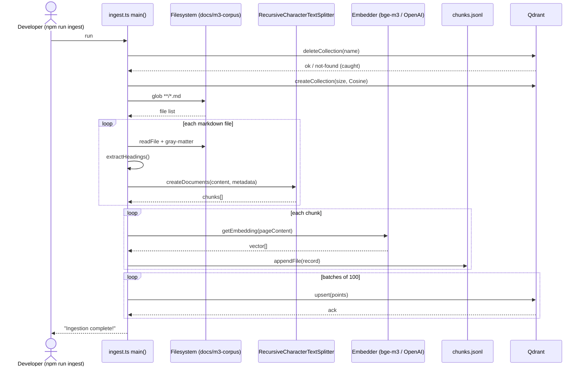
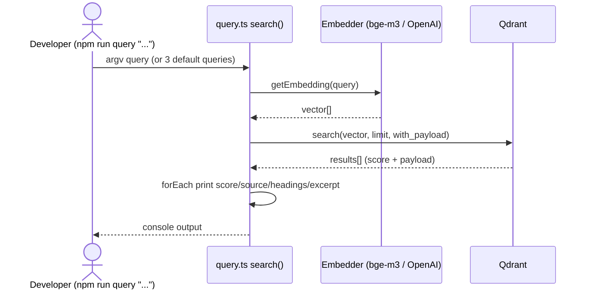
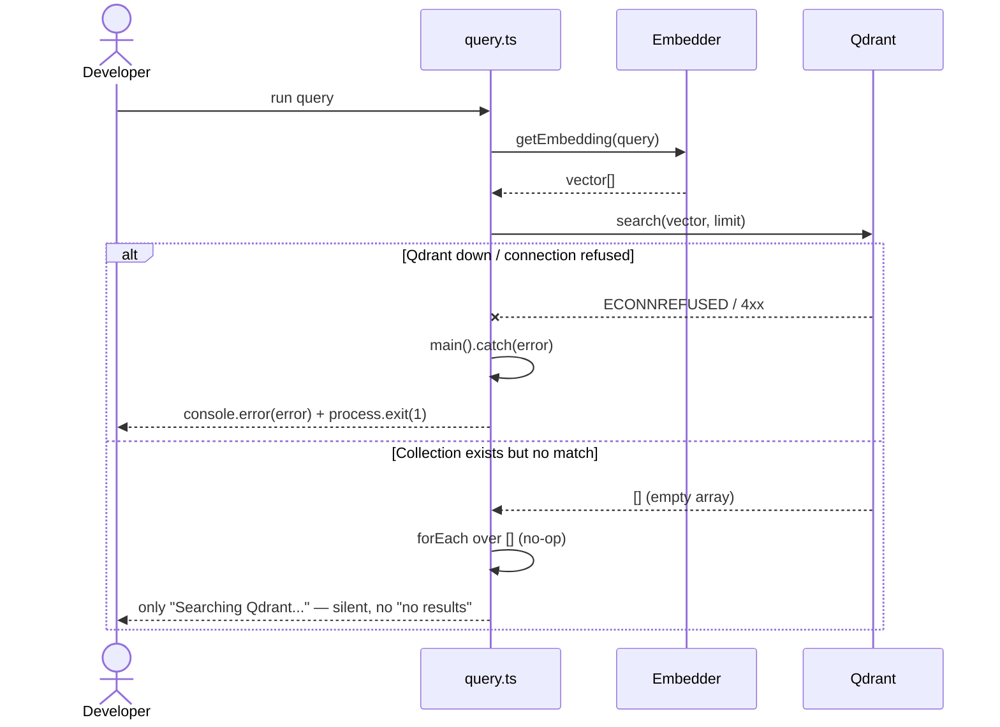

# RAG Module — Spec

> Living-doc spec produced via the 4-step reverse-engineering recipe
> (`/tmp/aidev-cm/M6/6.3-legacy-strategies/recipe-cc-reverse-engineering.md`).
> Source of truth: `mcps/rag/ingest.ts`, `mcps/rag/query.ts`, `mcps/rag/package.json`,
> with cross-reference to `mcps/search-docs/src/index.ts`.
> READ-ONLY reverse engineering — no source was modified.

## Overview (Step 1 — Understand)

The RAG module is an offline, CLI-driven retrieval-augmented-generation pipeline
that indexes the TradeWitness documentation corpus into a vector store and lets a
developer query it semantically. It has two entry points, both run via `tsx`
(`npm run ingest` / `npm run query` in `mcps/rag/package.json`).

**Ingest path (`ingest.ts`).** `main()` first *deletes* the target Qdrant
collection (`QDRANT_COLLECTION`, default `tradewitness_m3_docs`) then recreates it
with a fixed vector size and Cosine distance. Vector size is provider-dependent:
`1536` for `openai` (`text-embedding-3-small`), otherwise `1024` for the default
local `bge-m3` model (`Xenova/bge-m3` via `@xenova/transformers`). It globs
`docs/m3-corpus/**/*.md`, and for each file strips YAML frontmatter with
`gray-matter`, extracts every Markdown heading (`#`..`######`) into
`parent_headings`, and splits the body with LangChain's
`RecursiveCharacterTextSplitter` (chunkSize 1800, overlap 200, heading-aware
separators). Each chunk is embedded **one at a time**, assigned a fresh `uuidv4`,
mirrored to `chunks.jsonl` (append), and accumulated in memory. Finally all points
are upserted to Qdrant in batches of 100.

**Query path (`query.ts`).** `main()` reads a query from argv (joined into one
string, `limit=5`) or, with no args, runs three hard-coded "mandatory test
queries" at `limit=3`. `search()` embeds the query with the *same* `getEmbedding`
helper, calls `client.search` with `with_payload: true`, and prints score, source,
type, summary, headings and a 700-char excerpt per hit.

**Business rules / assumptions.** Embedding provider and vector size must match
between ingest and query (and the sibling `search-docs` MCP, which reuses the
identical embedder bootstrap but has no vector-size constant of its own). The
corpus is assumed to be Markdown with optional frontmatter (`type`, `tags`,
`last_modified`). `summary` is naively the first 100 chars; `keywords` aliases
`tags`. The pipeline is destructive (full re-index) and non-incremental. Qdrant is
assumed reachable at `QDRANT_URL` (default `http://localhost:6333`).

## Decision Table (Step 2)

| # | Condition | Then-action | Else-action | Edge case / failure mode |
|---|-----------|-------------|-------------|--------------------------|
| 1 | `EMBEDDING_PROVIDER === 'openai'` | `VECTOR_SIZE = 1536`; embed via OpenAI `text-embedding-3-small` | `VECTOR_SIZE = 1024`; embed via local `Xenova/bge-m3` | Any value other than `openai`/`bge-m3` silently falls into the bge-m3 branch (1024) |
| 2 | `QDRANT_URL` env set | Use provided URL | Default `http://localhost:6333` (query) / same default (ingest) | search-docs MCP defaults to `127.0.0.1` instead — host-string mismatch |
| 3 | `bgeEmbedderPromise` already initialized | Reuse cached pipeline promise | Lazily `import('@xenova/transformers')` and build pipeline | First call pays model-download/load cost; concurrent first calls are deduped by the shared promise |
| 4 | `deleteCollection(COLLECTION_NAME)` throws (collection absent) | Caught; log "might not exist"; proceed | Log "Deleted collection" | Masks *all* delete errors (auth, network), not just not-found |
| 5 | A markdown line matches `^(#{1,6})\s+(.*)` | Push heading text to `parent_headings` | Skip line | `#`-in-fenced-code-block treated as heading (false positive) |
| 6 | `data.type` present in frontmatter | Use it | Default `'document'` | Malformed YAML throws in `matter()`, aborting whole run |
| 7 | `data.tags` present | Use for `tags` and `keywords` | Default `[]` | Non-array `tags` propagated as-is into payload |
| 8 | Loop index `i % 10 === 0` | Log progress | No log | Cosmetic only |
| 9 | `points.length` > `batchSize` (100) | Upsert in multiple slices of 100 | Single upsert of all points | Any one batch upsert failure rejects `main()` → partial index left behind |
| 10 | `query.ts` argv length > 0 | Search joined argv string, `limit=5` | Run 3 hard-coded test queries, `limit=3` | Empty/whitespace query still embedded & searched (no validation, unlike search-docs MCP) |
| 11 | Qdrant `search` returns results | `forEach` prints each result | Loop body never runs | Empty result set prints only the "Searching..." line — no "no matches" message |
| 12 | `result.payload.content` truthy | Print 700-char excerpt | Skip excerpt line | Missing/null content silently omits excerpt |
| 13 | search-docs MCP: `query` non-empty string | Proceed | Throw "query must be a non-empty string." | RAG CLI lacks this guard entirely |
| 14 | search-docs MCP: `top_k` integer in 1..10 | Proceed | Throw range error | RAG CLI's `limit` is unvalidated |
| 15 | `getEmbedding` / `search` rejects | `main().catch` logs (ingest) / logs + `process.exit(1)` (query) | Normal completion | Ingest does not exit non-zero on failure — CI may read it as success |

## Sequence Diagram (Step 3)

### Ingest flow (happy path)

### Query flow (happy path)

### Error path (Qdrant unavailable / empty results)

## Edge Cases (Step 4)

- **Empty corpus**: `glob` returns `[]`, `allChunks` is empty, an empty collection is
  created and 0 points upserted. No warning is emitted — a silent no-op index.
- **Oversized single chunk**: `chunkSize: 1800` is a target, not a hard cap; a
  contiguous 1800+ char block with no separator can exceed the size, and the
  embedding model may truncate it past its token limit, degrading recall.
- **Embedding dimension mismatch**: switching `EMBEDDING_PROVIDER` between
  ingest (e.g. bge-m3 → 1024) and query (openai → 1536) makes `client.search`
  fail with a vector-dimension error; the collection itself is fixed-size, so a
  mismatched query is rejected by Qdrant rather than silently mis-scored.
- **Qdrant unavailable (ingest)**: `createCollection` / `upsert` reject; `main().catch`
  logs but the process still exits 0 — partial or no index, false-success in CI.
- **Qdrant unavailable (query)**: `main().catch` logs and `process.exit(1)`.
- **Duplicate IDs**: every chunk gets a fresh `uuidv4`, so re-running ingest with
  unchanged content creates entirely new IDs; combined with `deleteCollection`
  the store stays consistent, but `chunks.jsonl` is rewritten each run (truncated
  via `writeFile('')`) so stale duplicates do not accumulate there.
- **Memory blowup on large corpus**: every chunk's vector is held in the in-memory
  `points[]` array before any upsert; a large corpus (e.g. 1024-float vectors ×
  many thousands of chunks) can exhaust heap since upsert happens only after the
  full embed loop completes.
- **Malformed frontmatter**: `gray-matter` throws on invalid YAML, aborting the
  entire run mid-file; there is no per-file try/catch, so one bad doc blocks all.
- **Non-deterministic / drifting embeddings**: re-ingesting after a transformers or
  model-version bump can shift vectors, silently changing search ranking with no
  versioning of the embedding model recorded in the payload.
- **Empty / whitespace query**: the RAG CLI does not validate input (unlike the
  search-docs MCP), so a blank query is embedded and searched, returning
  low-signal nearest neighbors instead of an error.
- **Empty result set**: `results.forEach` over `[]` prints nothing meaningful — no
  "no matches found" message, easily mistaken for a silent failure.
- **Headings false positives**: `extractHeadings` regex matches `#` lines anywhere,
  including inside fenced code blocks, polluting `parent_headings`.
- **Naive summary truncation**: `summary` is the literal first 100 chars of the
  body (newlines flattened) — can cut mid-word and is not a real summary.
- **Provider typo fallthrough**: any `EMBEDDING_PROVIDER` value other than `openai`
  silently selects bge-m3/1024, so a typo (e.g. `openi`) misconfigures dimensions
  without error.
- **Partial batch upsert failure**: if batch N of the 100-sized upserts rejects,
  batches 1..N-1 are already committed, leaving a partially populated collection.
- **`.env` resolution depends on CWD**: env files are loaded from `../../` relative
  to `process.cwd()`; running from the wrong directory silently loads defaults.
- **Host default mismatch**: ingest/query default Qdrant to `localhost`, while the
  search-docs MCP defaults to `127.0.0.1` — environments resolving these
  differently (IPv6/hosts file) can connect to different endpoints.

## Open Questions

- Is there an intended incremental/upsert mode, or is full delete-and-rebuild the
  permanent design? `chunks.jsonl` (532 rows in the committed file) implies a
  reproducible snapshot, but nothing reads it back.
- Should ingest exit non-zero on failure for CI safety (current `main().catch`
  only logs)?
- Is `chunks.jsonl` an audit artifact, a fixture, or a fallback source? Nothing in
  `query.ts` or the search-docs MCP reads it.
- Why does the embedding bootstrap live duplicated in three files
  (`ingest.ts`, `query.ts`, `search-docs/src/index.ts`) instead of a shared
  module? Is divergence (e.g. host defaults) intentional?
- Is `bge-m3` (1024) or `openai` (1536) the production default? `EMBEDDING_PROVIDER`
  defaults to `bge-m3` everywhere, but the test queries read like product QA.
- Should `parent_headings` be scoped per-chunk rather than all headings of the
  whole file (currently every chunk inherits the full file's heading list)?
- What is the expected behavior on an empty corpus — fail loudly or create an
  empty collection?

## Suggested Characterization Tests

Concrete tests to pin current behavior before any refactor. Use a disposable
collection name and a tmp corpus dir.

1. **Vector size by provider.** With `EMBEDDING_PROVIDER=openai`, assert the
   constant resolves to `1536`; with unset/`bge-m3`, assert `1024`; with a typo
   `EMBEDDING_PROVIDER=openi`, assert it still resolves to `1024` (fallthrough).
2. **Heading extraction.** Feed `"# A\n## B\nbody\n### C"` to `extractHeadings`;
   expect `["A", "B", "C"]`. Feed a fenced block containing `# notaheading`;
   expect it is (currently, buggy) included — assert `["notaheading"]` to lock the
   present behavior.
3. **Splitter chunk count/size.** Run the configured `RecursiveCharacterTextSplitter`
   (1800/200) over a 5000-char heading-free string; assert chunk count is `3` and
   that adjacent chunks share a 200-char overlap.
4. **Frontmatter parsing.** A doc with `---\ntype: incident\ntags: [a,b]\n---\nbody`
   yields chunk metadata `type === 'incident'`, `keywords === ['a','b']`. A doc
   with *no* frontmatter yields `type === 'document'`, `keywords === []`.
5. **Malformed frontmatter aborts.** A doc with invalid YAML frontmatter causes
   `processDocument` to throw — assert the promise rejects (documents the
   no-per-file-recovery behavior).
6. **Summary truncation.** Body of 250 chars → `summary` is exactly 100 chars +
   `"..."` with newlines replaced by spaces.
7. **chunks.jsonl shape.** After ingest of a 1-chunk corpus, the single JSONL line
   parses to an object with keys exactly
   `{chunk_id, source_file, type, parent_headings, keywords, summary, content}`
   and `chunk_id` is a valid UUID v4.
8. **Collection lifecycle.** Mock `QdrantClient`; assert ingest calls
   `deleteCollection` then `createCollection({vectors:{size,distance:'Cosine'}})`
   with `size` matching the provider, in that order.
9. **Batch upsert.** With 250 generated points and `batchSize=100`, assert
   `upsert` is called 3 times with batch lengths `[100,100,50]`.
10. **Empty corpus.** Glob returns `[]` → `createCollection` is still called and
    `upsert` is never called; process completes (locks the silent no-op).
11. **Query default vs argv.** With no argv, assert `search` is invoked 3 times with
    `limit=3` and the three known prompt strings; with argv `["a","b"]`, assert one
    `search("a b", 5)` call.
12. **Empty results printing.** Mock `client.search` → `[]`; assert no per-result
    lines are printed and the process does not throw (documents the missing
    "no matches" message).
13. **Query error exit code.** Mock `client.search` to reject; assert
    `query.ts main()` triggers `process.exit(1)`. Contrast: mock ingest's `upsert`
    to reject and assert the process exit code is `0` (current false-success).
14. **search-docs MCP input validation (contrast).** `search_project_docs({query:""})`
    returns an `isError: true` result with text `Error: query must be a non-empty string.`;
    `top_k: 11` returns the range error. Documents the guardrails the RAG CLI lacks.
