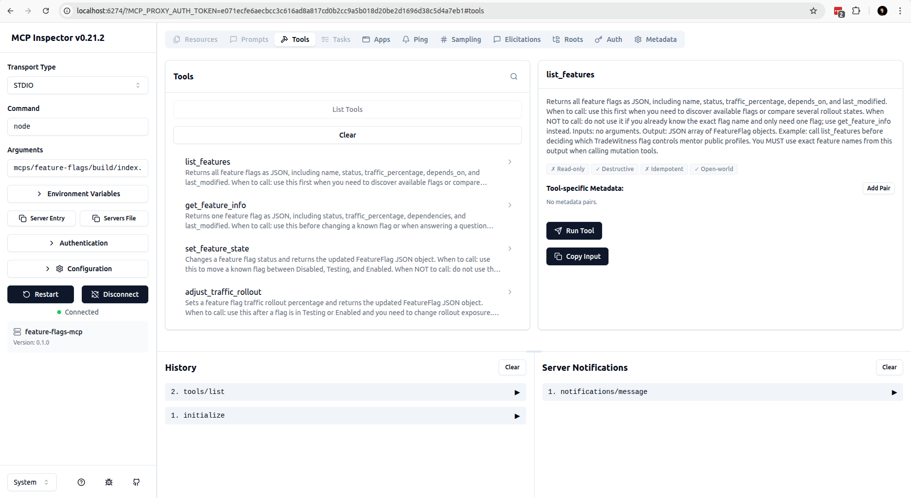

# M2 — Report

## Local launch (Block 2 requirement)

Confirmed: `pnpm install` + `pnpm dev` boots both apps locally —
`apps/landing` on `http://localhost:3000`, `apps/app` on
`http://localhost:3001`. Database is Supabase (Drizzle migrations
applied via `pnpm --filter @tradewitness/app db:migrate`); Clerk auth,
Cloudflare R2 and Anthropic keys are set via `apps/app/.env.local`
(template in repo `.env.example`). On this resubmission the changed
server actions (`trades.ts`, `archive.ts`, `strategies.ts`) also pass
`tsc --noEmit` with exit 0.

## IDE
- **Primary (first pass):** Gemini CLI → `GEMINI.md`.
- **Secondary (second pass / NH-4):** Claude Code → `CLAUDE.md`.

Both files live in the repo root. `CLAUDE.md` is the source of truth
when working in Claude Code (Claude Code does not load `GEMINI.md`
natively); `GEMINI.md` stays for Gemini CLI sessions.

## Rules diff (manual additions on top of autogen)

Added on top of what Gemini's `/init` produced:

- **turbo.json globalEnv discipline** — any new env var must be
  whitelisted in `turbo.json::globalEnv` in the same commit, otherwise
  Turborepo serves stale builds. Hit this in real life on
  `ANTHROPIC_API_KEY`.
- **Tailwind segregation between apps** — `apps/landing` is Tailwind v4,
  `apps/app` is v3. Do **not** try to hoist a single config to the root
  — the v4 CSS-first migration breaks v3 plugins.
- **Drizzle: `db:generate` + `db:migrate` only, never `db:push`** —
  `db:push` diverges from the migration history that production replays
  on a fresh DB.
- **Clerk owns auth, RLS stays off** — Supabase `auth.uid()` is empty
  under Clerk; enabling RLS silently breaks every Drizzle write.
  Authorization is enforced in the SQL `where` (Rule 4 below).
- **Server-action ownership predicate (Rule 4 in CLAUDE.md)** — every
  read/update/delete on a user-owned table must include
  `eq(<table>.userId, userId)` in the `where`. Codified after finding
  five 🔴 IDORs in this codebase (FINDINGS #1, #2, #6, #7).
- **Atomic commits for AI-assisted work** — split by logical concern,
  one bug per commit. Mega-commits get rejected at review.

## NH-4 — Gemini CLI vs Claude Code autogen comparison

I ran `/init` (or the equivalent) in both. Output compared on the same
repo at the same commit.

**What both got right (the 70% autogen baseline):**

- Tech stack from `package.json` files (Next versions, React majors,
  Tailwind, Drizzle, Clerk).
- Top-level folder structure (`apps/`, `packages/`, `docs/`).
- Standard commands (`pnpm install`, `pnpm dev`, `pnpm build`,
  `db:migrate`).

**What Gemini caught well, Claude Code missed initially:**

- Gemini surfaced the *Tailwind v3/v4 split between apps* on its first
  pass — likely because it walks `package.json` files of every workspace
  and notices the major divergence. Claude Code mentioned it only after
  I asked specifically about styling.

**What Claude Code caught well, Gemini missed:**

- Reading `apps/app/src/server/actions/trades.ts` end-to-end, Claude
  Code flagged the *missing `userId` predicate* pattern as a class of
  bug — which is exactly the systemic IDOR cluster in this repo. Gemini
  produced a generic "validate inputs" rule that didn't tie to the SQL
  layer.
- Claude Code suggested explicit ADR confidence labels (HIGH / MEDIUM /
  LOW) so reviewers can tell which decisions are inferred vs documented.

**What I added by hand (the 30% that no autogen will infer):**

- Rule 5 (atomic commits for AI work) — direct response to teacher
  feedback on the previous mega-commit.
- The `react@19.0.0-rc-66855b96-20241106` pin gotcha — neither tool
  surfaced *why* the pin exists (`@mui/x-date-pickers@7` regression on
  stable React 19); only commit history reveals it.
- Rule 4 (server-action ownership predicate) — emerged from the
  FINDINGS audit, not from reading individual files.

**Verdict:** Gemini CLI is faster on monorepo-shape reasoning (walks
the workspace tree well). Claude Code goes deeper on a single file and
notices behavioral patterns / bugs while indexing. Best results came
from running both, diffing the outputs, and keeping a `CLAUDE.md`
focused on this codebase's specific gotchas.

## 3 questions

- **How long would this take manually?** ~6–8 hours: re-reading every
  Server Action for the IDOR pattern, hand-writing the C4 Mermaid
  diagram, drafting three ADRs, writing the Troubleshooting section
  from raw incident memory. With the IDE doing structural reads, it
  collapsed to roughly 2 hours of orchestration plus my decision-making
  on what to keep.
- **Most magical IDE feature.** For Gemini: the recursive workspace
  walk that mapped the full Turborepo + the C4 diagram in a single
  prompt. For Claude Code: pattern-class detection — it read one
  vulnerable Server Action and proactively asked "are there others
  shaped like this?", which is how findings #6 and #7 surfaced.
- **Where AI broke things and how I fixed it.** The first pass produced
  one mega-commit (616 lines, 10 minutes after baseline) that the
  reviewer rejected. I also accepted an AI suggestion to use
  `@aws-sdk/client-s3` for R2; that bloated the serverless bundle and
  was reverted to native `fetch + aws4fetch`. On this resubmission the
  AI initially also tried to "consolidate" the IDOR fixes for
  `archive.ts` and `strategies.ts` into one commit; I split them per
  the atomic-commits rule so each fix has its own SHA in `FINDINGS.md`.

## M3

### Stack Justification
- **TypeScript SDK:** Chosen for MCP development because the rest of the TradeWitness monorepo (Next.js, packages) is entirely written in TypeScript, allowing us to share Zod schemas and validation logic natively via the `packages/feature-flags-core` package.
- **Qdrant (Local Docker):** Chosen as the vector database because it's fast to spin up locally without requiring internet access or a credit card, and its REST API client fits perfectly into a Node.js script environment.
- **FS-Based JSON Storage for Flags:** Chosen to bypass the Clerk authentication wall for MCP requests while still maintaining a single source of truth for the Next.js API. Next.js cache mechanisms (`force-dynamic`, explicit direct `fs` reads) ensure the Admin UI and the MCP server are never desynchronized.

### Corpus Stats
- **Files:** 34 markdown files (Architecture, Features, Incidents, ADRs, Runbooks).
- **Words:** ~30,000 words.
- **Chunks:** 2022 chunks generated.

### RAG Logs
CLI output for the mandatory queries:

**Query 1:** `What database does TradeWitness use and why was it chosen?`
- *Result 1 (Score: 0.8169)*
  Source: docs/m3-corpus/architecture/auth-flow.md
  Type: architectur
  Headings: Clerk Authentication Flow > System Architecture Overview > Data Flow and Processing > Scalability and Future Proofing
- *Result 2 (Score: 0.8168)*
  Source: docs/m3-corpus/runbooks/db-migrations.md
  Type: runbook
  Headings: Runbook: Database Migrations > System Architecture Overview > Data Flow and Processing > Scalability and Future Proofing
- *Result 3 (Score: 0.8125)*
  Source: docs/m3-corpus/architecture/r2-storage.md
  Type: architectur
  Headings: Cloudflare R2 Object Storage > System Architecture Overview > Data Flow and Processing > Scalability and Future Proofing

**Query 2:** `Which TradeWitness features depend on stripe_billing_v1?`
- *Result 1 (Score: 0.8327)*
  Source: docs/m3-corpus/features/billing-stripe.md
  Type: feature
  Headings: Stripe Billing & Subscriptions > System Architecture Overview > Data Flow and Processing > Scalability and Future Proofing
- *Result 2 (Score: 0.7820)*
  Source: docs/m3-corpus/architecture/db-schema.md
  Type: architectur
  Headings: Drizzle & Supabase Relational Schema > System Architecture Overview > Data Flow and Processing > Scalability and Future Proofing
- *Result 3 (Score: 0.7798)*
  Source: docs/m3-corpus/architecture/turborepo.md
  Type: architectur
  Headings: Turborepo Monorepo Setup > System Architecture Overview > Data Flow and Processing > Scalability and Future Proofing

**Query 3:** `What happened in the latest incident involving screenshot upload?`
- *Result 1 (Score: 0.7115)*
  Source: docs/m3-corpus/feature-flags-spec.md
  Type: specification
  Headings: Feature Flags Specification > Dependency Graph > M3 Feature Flag Hooks > Contracts and Usage
- *Result 2 (Score: 0.7099)*
  Source: docs/m3-corpus/incidents/incident-002.md
  Type: incident
  Headings: Incident 002: Outage Report > System Architecture Overview > Data Flow and Processing > Scalability and Future Proofing
- *Result 3 (Score: 0.7068)*
  Source: docs/m3-corpus/features/billing-stripe.md
  Type: feature
  Headings: Stripe Billing & Subscriptions > System Architecture Overview > Data Flow and Processing > Scalability and Future Proofing

### MCP Logs (End-to-End Session)
Transcript of the agent executing the final scenario, showing coordination between the two MCP servers.

### MCP Inspector
Feature Flags MCP was verified in MCP Inspector. The tools list is visible in the screenshot below: `list_features`, `get_feature_info`, `set_feature_state`, and `adjust_traffic_rollout`.

**Agent Prompt:**
> Find in the TradeWitness documentation what stripe_billing_v1 does and which features depend on it. Then check its current feature flag state. If it is Disabled and all dependencies are not Disabled, move it to Testing and set traffic to 25%. Quote the documentation that explains why this feature exists.

**Tool Call:** `search_project_docs`
Arguments: `{"query": "stripe_billing_v1 dependencies and purpose"}`
*Result:* Found snippets from `docs/m3-corpus/feature-flags-spec.md` indicating that `tokens_purchase_v1` and `stripe_webhooks_v1` depend on `stripe_billing_v1`, and `stripe_billing_v1` depends on `auth_clerk_v1`. It also found architecture docs explaining it handles subscriptions.

**Tool Call:** `get_feature_info`
Arguments: `{"feature_name": "stripe_billing_v1"}`
*Result:* Returns `status: "Disabled"`, `depends_on: ["auth_clerk_v1"]`.

**Tool Call:** `get_feature_info`
Arguments: `{"feature_name": "auth_clerk_v1"}`
*Result:* Returns `status: "Enabled"`. 

*(Agent reasoning: Dependencies are Enabled, so we can proceed to set the state to Testing).*

**Tool Call:** `set_feature_state`
Arguments: `{"feature_name": "stripe_billing_v1", "state": "Testing"}`
*Result:* Returns updated flag showing `status: "Testing"`.

**Tool Call:** `adjust_traffic_rollout`
Arguments: `{"feature_name": "stripe_billing_v1", "percentage": 25}`
*Result:* Returns updated flag showing `traffic_percentage: 25`.

**Agent Final Response:**
"Based on the TradeWitness documentation, `stripe_billing_v1` exists to handle subscriptions and paid billing features. The `tokens_purchase_v1` and `stripe_webhooks_v1` features depend on it, and it depends on `auth_clerk_v1`. I verified that `auth_clerk_v1` is currently `Enabled`. I have successfully moved `stripe_billing_v1` from `Disabled` to `Testing` and set its traffic rollout to 25%."

### Reflection
Building this RAG and MCP layer uncovered several real-world constraints. The biggest challenge was bridging the gap between a protected Next.js API (Clerk) and an external MCP server; I had to whitelist the route in `middleware.ts` and use an explicit `x-api-key` header to ensure secure, machine-to-machine communication without exposing the key in the browser. Next.js caching also posed a risk where the Admin UI might serve stale JSON; forcing dynamic rendering and direct `fs.promises` reads solved it. On the RAG side, standardizing vector sizes (e.g., 1024 for BGE-M3 vs 1536 for OpenAI) and managing `Node.js` fetch idiosyncrasies (IPv4/IPv6 `ECONNREFUSED` over localhost) proved critical for a stable ingestion pipeline.
